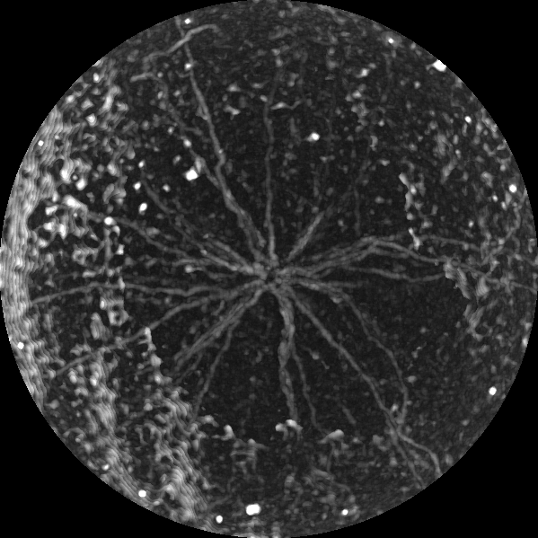
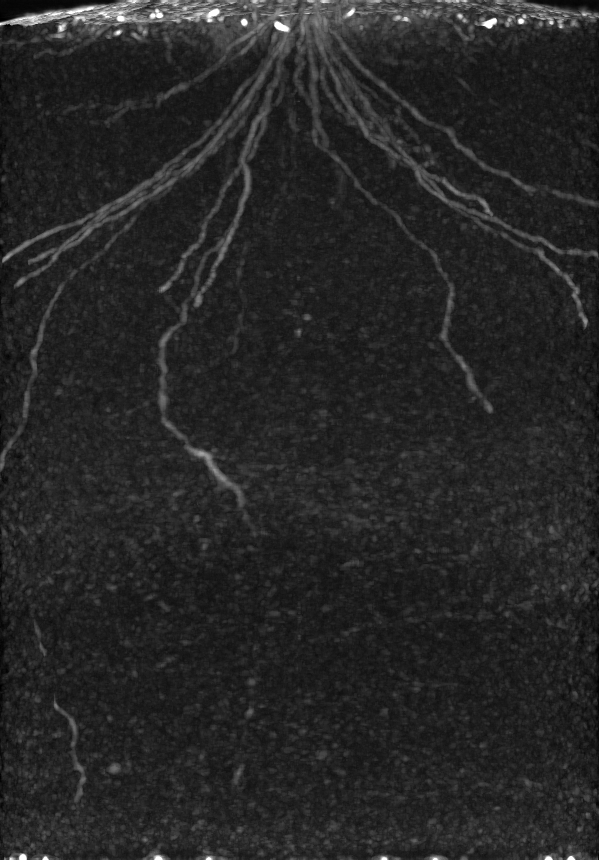
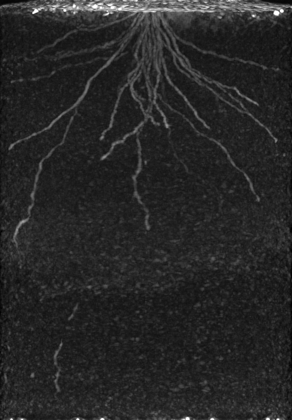

# RSAvis3D: An robust and rapid image processing for root segmentation from X-ray CT images

RSAvis3D is the Python program for root segmentation from X-ray CT images. RSAvis3D uses a 3-D median filter and edge detection algorithm to isolate root segments. 

## Installation

    $ git clone https://github.com/st707311g/RSAvis3D.git

RSAvis3D requires Python (version > 3.8). Check it by the following command:

    $ python --version

After confirmation, install required modules:

    $ pip install --upgrade pip
    $ pip install -r RSAvis3D/requirements.txt

## How to run

    $ python RSAvis3D [-h] [-i INDIR] [-b BLOCK_SIZE] [-a] [-m MEDIAN_SIZE]
                [-e EDGE_SIZE] [-c CYLINDER_RADIUS] [-f {png,tif,jpg}] [-w]
                [-v]

    optional arguments:
      -h, --help            show this help message and exit
      -i INDIR, --indir INDIR
                            import a directory
      -b BLOCK_SIZE, --block_size BLOCK_SIZE
                            determine divided volume size (>= 64)
      -a, --all_at_once     determine all-at-onec processing
      -m MEDIAN_SIZE, --median_size MEDIAN_SIZE
                            determine median kernel size (>= 1)
      -e EDGE_SIZE, --edge_size EDGE_SIZE
                            determine blur kernel size for edge detection (>= 1)
      -c CYLINDER_RADIUS, --cylinder_radius CYLINDER_RADIUS
                            determine cylinder mask radius (>= 64)
      -f {png,tif,jpg}, --format {png,tif,jpg}
                            determine file format type
      -w, --overwrite       overwrite results
      -v, --version         show version information

Basic usage of RSAvis3D is

    $ python RSAtrace3D -i INDIR

## Demonstration data analysis

Download and unzip the demo data archive.

    $ wget https://rootomics.dna.affrc.go.jp/data/rice_root_daily_growth.zip
    $ unzip rice_root_daily_growth.zip
    $ rm rice_root_daily_growth.zip

There are 21 directories and 1 files in *rice_root_daily_growth*.

    $ ls rice_root_daily_growth
    DAS_07  DAS_10  DAS_13  DAS_16  DAS_19  DAS_22  DAS_25  description.docx
    DAS_08  DAS_11  DAS_14  DAS_17  DAS_20  DAS_23  DAS_26
    DAS_09  DAS_12  DAS_15  DAS_18  DAS_21  DAS_24  DAS_27

Let's try one CT data, *rice_root_daily_growth/DAS_27*.

    $ python RSAvis3D -i rice_root_daily_growth/DAS_27

If your PC has enough memory space, alternatively the following command well works.

    $ python RSAvis3D -i rice_root_daily_growth/DAS_27 -a

Then, one directory and three image files appear.

    $ ls rice_root_daily_growth
    DAS_07  DAS_11  DAS_15  DAS_19  DAS_23  DAS_27            DAS_27_RSA_2.png
    DAS_08  DAS_12  DAS_16  DAS_20  DAS_24  DAS_27_RSA        description.docx
    DAS_09  DAS_13  DAS_17  DAS_21  DAS_25  DAS_27_RSA_0.png
    DAS_10  DAS_14  DAS_18  DAS_22  DAS_26  DAS_27_RSA_1.png

The image processed image files are saved in *rice_root_daily_growth/DAS_27_RSA*. Parallel projections along three axis are *DAS_27_RSA_0.png*, *DAS_27_RSA_1.png*, and *DAS_27_RSA_2.png*.

  

## Citation

If you use this code or modified ones, please cite our work: Shota Teramoto et al. (2020) [High-throughput three-dimensional visualization of root system architecture of rice using X-ray computed tomography.](https://doi.org/10.1186/s13007-020-00612-6) 

## Project homepage
https://rootomics.dna.affrc.go.jp/en/