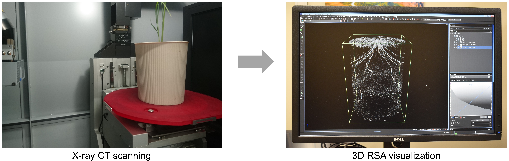

# RSAvis3D: An robust and rapid image processing for root segmentation from X-ray CT images


 

RSAvis3D is the Python program for root segmentation from X-ray CT images. RSAvis3D uses a 3D median filter and edge detection algorithm to isolate root segments. 

## system requirements

This software is confirmed to work with Python 3.8.12 on Ubuntu 20.04. I recommend creating a virtual environment for python 3.8.12 with `virtualenv`.

## Installation

Run the following commands:

```
git clone https://github.com/st707311g/RSAvis3D.git
cd RSAvis3D
```

The following command will install the required packages.

```
pip install -U pip
pip install -r requirements.txt
```

This software can reduce processing time by using `CuPy`. Installation depends on the version of `CUDA Toolkit`. Please build the environment according to your own version of `CUDA Toolkit`. For example, if the version of `CUDA Toolkit` is 11.4, install cupy with the following command.

```
pip install cupy-cuda114
```

Please check if CuPy is available by using the following command.
```
python is_cupy_available.py
```

## How to run

```
    python . [-h] [-s SOURCE] [-b BLOCK_SIZE] [-a] [-m MEDIAN_KERNEL_SIZE]
         [-e EDGE_SIZE] [-c CYLINDER_RADIUS] [-f {png,tif,jpg}]
         [-i INTENSITY_FACTOR]

    optional arguments:
        -h, --help            show this help message and exit
        -s SOURCE, --source SOURCE
                                Indicate source directory.
        -b BLOCK_SIZE, --block_size BLOCK_SIZE
                                Indicate divided volume size (>= 64)
        -a, --all_at_once     Perform all-at-onec processing
        -m MEDIAN_KERNEL_SIZE, --median_kernel_size MEDIAN_KERNEL_SIZE
                                Indicate median kernel size (>= 1)
        -e EDGE_SIZE, --edge_size EDGE_SIZE
                                Indicate blur kernel size for edge detection (>= 1)
        -c CYLINDER_RADIUS, --cylinder_radius CYLINDER_RADIUS
                                Indicate cylinder mask radius (>= 64)
        -f {png,tif,jpg}, --format {png,tif,jpg}
                                Indicate file format type
        -i INTENSITY_FACTOR, --intensity_factor INTENSITY_FACTOR
                                Indicate intensity factor (>0)
```

Basic usage of RSAvis3D is

    $ python . -s SOURCE

Parameters of RSAvis3D are modifiable by `-b`, `-m`, `-e`, and `-c` commands. If omitted, the parameters considered conditional on [the paper](https://doi.org/10.1186/s13007-020-00612-6) will be used.

## demonstration

Download the demo data (1.60G), which is a time-series X-ray CT data of an upland rice cultivar from 7 to 27 days after sowing ([Teramoto et al. 2020 Plant Methods](https://plantmethods.biomedcentral.com/articles/10.1186/s13007-020-00612-6)). The intensity of this data is normalized by `normalize_intensity_inspeXio_SMX-225CT_FPD_HR.py`. CT slice images were converted into 8 bit jpeg files, signal intensity of the air is around 0 and signal intensity of the soil is around 128.

```
wget https://rootomics.dna.affrc.go.jp/data/rice_root_daily_growth_intensity_normalized.zip
unzip rice_root_daily_growth_intensity_normalized.zip
rm rice_root_daily_growth_intensity_normalized.zip
```

There are 21 directories in *rice_root_daily_growth_intensity_normalized*.

```
ls rice_root_daily_growth_intensity_normalized
DAS07  DAS09  DAS11  DAS13  DAS15  DAS17  DAS19  DAS21  DAS23  DAS25  DAS27
DAS08  DAS10  DAS12  DAS14  DAS16  DAS18  DAS20  DAS22  DAS24  DAS26
```

If you want to obtain RSA segments, please specify the target directory.
```
python . -s rice_root_daily_growth_intensity_normalized
```

Alternatively,, if your PC has enough memory space, alternatively the following command well works.
```
python . -s rice_root_daily_growth_intensity_normalized -a
```

Processed files are saved in the .segmentated directory.

```
ls -a rice_root_daily_growth_intensity_normalized/.segmentated
.                 .projection1      DAS07  DAS11  DAS15  DAS19  DAS23  DAS27
..                .projection1.gif  DAS08  DAS12  DAS16  DAS20  DAS24
.projection0      .projection2      DAS09  DAS13  DAS17  DAS21  DAS25
.projection0.gif  .projection2.gif  DAS10  DAS14  DAS18  DAS22  DAS26
```

Projection images are saved in `.projection0`, `.projection1`, and `.projection2` directory. Animation gif files are saved as `.projection0.gif `, `.projection1.gif`, and `.projection2.gif`.


 

## version policy

Version information consists of major and minor versions (major.minor). When the major version increases by one, it is no longer compatible with the original version.When the minor version invreases by one, compatibility will be maintained. Revisions that do not affect functionality, such as bug fixes and design changes, will not affect the version number.

## citation

Please cite the following article:

Shota Teramoto et al. (2020) [High-throughput three-dimensional visualization of root system architecture of rice using X-ray computed tomography.](https://doi.org/10.1186/s13007-020-00612-6)  Plant Methods. 16, Article number: 66

## license

NARO NON-COMMERCIAL LICENSE AGREEMENT Version 1.0

This license is for 'Non-Commercial' use of software for RASvis3D

* Scientific use of RASvis3D is permitted free of charge.
* Modification of RASvis3D is only permitted to the person of downloaded and his/her colleagues.
* The National Agriculture and Food Research Organization (hereinafter referred to as NARO) does not guarantee that defects, errors or malfunction will not occur with respect to RASvis3D.
* NARO shall not be responsible or liable for any damage or loss caused or be alleged to be caused, directly or indirectly, by the download and use of RASvis3D.
* NARO shall not be obligated to correct or repair the program regardless of the extent, even if there are any defects of malfunctions in RASvis3D.
* The copyright and all other rights of RASvis3D belong to NARO.
* Selling, renting, re-use of license, or use for business purposes etc. of RASvis3D shall not be allowed. For commercial use, license of commercial use is required. Inquiries for such commercial license are directed to NARO.
* The RASvis3D may be changed, or the distribution maybe canceled without advance notification.
*In case the result obtained using RASvis3D in used for publication in academic journals etc., please refer the publication of RASvis3D and/or acknowledge the use of RASvis3D in the publication.

Copyright (C) 2020 National Agriculture and Food Research Organization. All rights reserved.

## project homepage
https://rootomics.dna.affrc.go.jp/en/

## Update history

* version 1.0 (Dec 10, 2020)
  * Initial version uploaded
  * README.md updated (Jan 29th, 2021)

* version 1.1 (May 25, 2022)
  * GPU Support
  * License Change (NARO NON-COMMERCIAL LICENSE AGREEMENT Version 1.0)
  * Rewrote the code for python 3.8.12